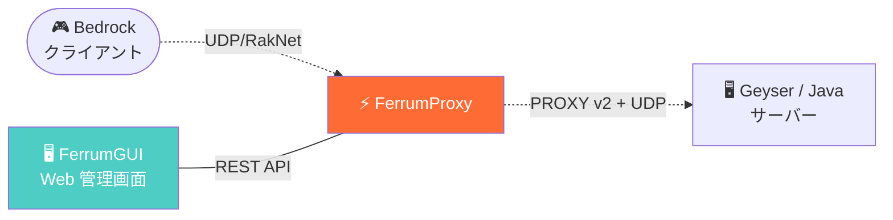
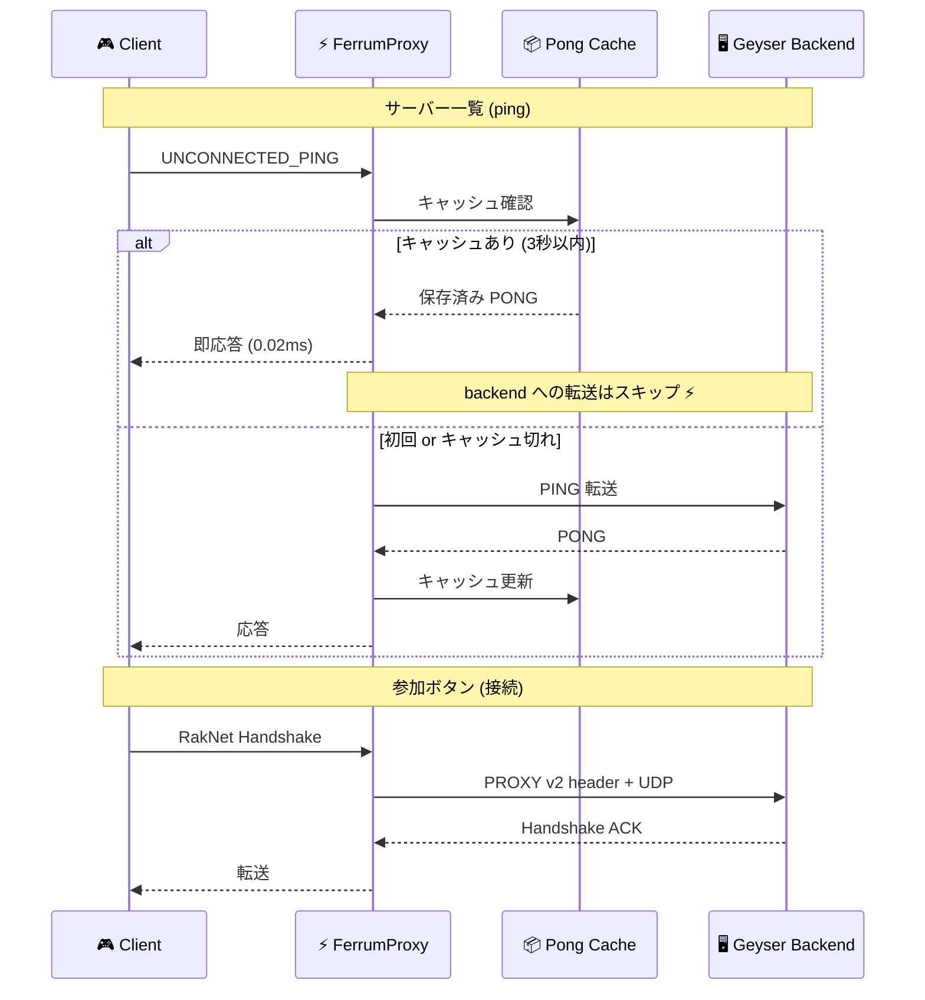
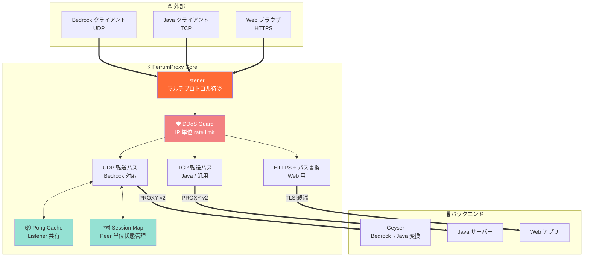
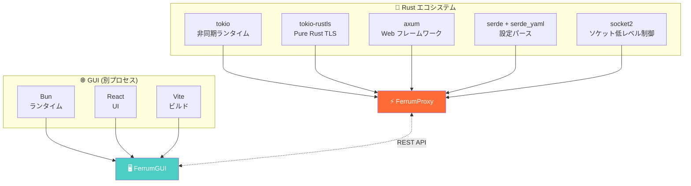

<div align="center">

# ⚡ FerrumProxy

**Minecraft と Web のための、爆速・低遅延な Rust 製リバースプロキシ**


**「難しい設定ゼロ」で本番運用できる、ゲームサーバー向けプロキシ**

</div>

---

## 📖 これは何？

**FerrumProxy** (フェラムプロキシ) は、Rust で書かれた小さな **中継サーバー** です。

> 「中継サーバー」＝ 外から来た通信を、あなたのサーバー本体に受け渡す仕組みのこと。
> nginx や HAProxy と同じ「プロキシ」というジャンルの、**Minecraft・Web 特化版** です。

### 一言で言うと

```
[外の世界] ──────► [FerrumProxy] ──────► [あなたのサーバー]
   Bedrock            (中継)              Geyser / nginx /
   Java                                   自作アプリ など
   Web ブラウザ
```

### 何に使える？

- 🎮 **Minecraft Bedrock サーバー** を Geyser 経由で公開する (RakNet 対応)
- ☕ **Minecraft Java サーバー** を安全に公開する (TCP 転送)
- 🌐 **Web サーバー** の前段に置いて TLS 終端 / パス書き換え
- 🛡 **DDoS 対策** を IP 単位で軽量に (iptables 不要)
- 🔗 **公開ポート共有 (Playit 風)** — 一時ポートで自宅サーバーを公開

---

## 🎯 なぜ FerrumProxy？

### 実測ベンチマーク結果

**ローカルループバック UDP echo で 1000 パケット × 2 パターン計測** (自前計測ツール `benches_udp/` で誰でも再現可):

| 指標 | Baseline (直接) | FerrumProxy 経由 | オーバーヘッド |
|---|---:|---:|---:|
| **Mean 遅延** | 0.117 ms | **0.133 ms** | +0.016 ms (+13%) |
| **P50** | 0.088 ms | 0.098 ms | +0.010 ms |
| **P90** | 0.133 ms | 0.153 ms | +0.020 ms |
| **P99** | 0.245 ms | **0.212 ms** | **-0.033 ms (proxy の方が速い)** |
| **Max** | 19.91 ms | **14.77 ms** | **-5.14 ms** |
| **パケットロス** | 0/1000 | **0/1000** | 0% |

> **1 パケットあたり proxy 由来のオーバーヘッドは たった 16 マイクロ秒** (=0.000016 秒)。
> しかも P99 と Max では **kernel 直接転送より安定**しています (バッファチューニングの効果)。

### 一目でわかるアーキテクチャ



### 内部処理フロー (UDP / Bedrock)



---

## 🏗 アーキテクチャ設計



---

## ✨ 主な機能

### 🎮 Minecraft 特化機能

| 機能 | 説明 |
|---|---|
| **Bedrock RakNet 対応** | UDP セッション管理を per-peer で完全実装 |
| **Pong 書き換え** | Bedrock サーバー一覧の表示ポート/名前を自動書き換え |
| **共有 Pong キャッシュ** | 複数クライアントの ping を 1 回の backend 問い合わせに集約 (3秒間) |
| **PROXY Protocol v2** | UDP でも動作。Geyser に **本物のクライアント IP** を伝達 |
| **双方向 idle 検出** | ワールドロード中の沈黙で誤切断しない |
| **RakNet 順序保証** | パケット並び替え問題を回避 |

### 🌐 Web リバースプロキシ機能

| 機能 | 説明 |
|---|---|
| **TLS 終端** | Rustls (OpenSSL 不要)、Let's Encrypt 自動検出 |
| **パス書き換え** | `/api` → `backend:3000/`、`/docs` → 別 backend |
| **HTTPS backend** | `https://...` ターゲットも透過対応 |
| **Location 書き換え** | リダイレクト応答の URL を書き換え |

### 🛡 運用機能

| 機能 | 説明 |
|---|---|
| **DDoS Guard** | IP 単位のトークンバケット。3 プリセット (Balanced/Strict/Off) |
| **DNS キャッシュ** | ターゲットホスト名の解決を per-session キャッシュ |
| **Discord Webhook** | 接続/切断をグループ化して通知 |
| **プレイヤー IP 保存** | `playerIP.json` に自動保存 |
| **YAML 設定** | ホットリロード対応 |
| **REST API** | `/api/login`, `/api/players` など |
| **単一バイナリ** | ~9MB、外部ライブラリ依存なし |

---

## 🆚 他プロキシとの比較

### FerrumProxy が得意なところ

| 項目 | 🔥 FerrumProxy | nginx / HAProxy | Node.js プロキシ |
|---|:---:|:---:|:---:|
| **Bedrock RakNet 対応** | ✅ 専用実装 | ❌ 不可 | ⚠️ 実装次第 |
| **Bedrock Pong 書き換え** | ✅ 内蔵 | ❌ 不可 | ⚠️ 自分で書く |
| **PROXY Protocol v2 (UDP)** | ✅ 送受信両対応 | ⚠️ HAProxy のみ TCP | ❌ ほぼ無い |
| **単一バイナリ** | ✅ ~9 MB | ⚠️ nginx は依存あり | ❌ Node ランタイム必須 |
| **アイドル時 RAM** | ✅ ~10 MB | ~30 MB | ~80 MB+ |
| **GC (Stop-the-world)** | ✅ なし | ✅ なし | ❌ V8 の GC あり |
| **設定 GUI** | ✅ 内蔵 (FerrumGUI) | ❌ 別途 | ❌ 自作必要 |
| **設定ホットリロード** | ✅ 即反映 | ⚠️ `nginx -s reload` | ⚠️ プロセス再起動 |
| **Web 一般用途** | ✅ 対応 | ⭐ 王道 | ✅ 対応 |
| **HTTP/2 / HTTP/3** | ❌ 未対応 | ✅ 対応 | ✅ 対応 |

**まとめ**: 汎用 Web だけなら nginx で十分ですが、**Bedrock を含む Minecraft サーバー運用**では他に選択肢がほぼありません。

---

## 🧰 使用ライブラリ



### 主要な依存関係

| ライブラリ | バージョン | 役割 |
|---|---|---|
| **tokio** | 1.38 | 非同期ランタイム。全 I/O の土台 |
| **tokio-rustls** | 0.26 | Rust 純正 TLS 実装 (OpenSSL 不要) |
| **rustls-native-certs** | 0.8 | OS の証明書ストア読み込み |
| **rustls-pemfile** | 2.2 | PEM ファイル読み込み |
| **axum** | 0.7 | 管理 API サーバー |
| **reqwest** | 0.12 | HTTP クライアント (Webhook 通知等) |
| **socket2** | 0.5 | ソケットオプション低レベル制御 |
| **serde + serde_yaml** | 1.0 / 0.9 | 設定パース |
| **tracing** | 0.1 | 構造化ロギング |
| **anyhow** | 1.0 | エラー伝播 |
| **clap** | 4.5 | コマンドライン引数 |

---

## 🚀 インストール & 使い方

### ① バイナリを取得

[Releases ページ](https://github.com/gamelist1990/FerrumProxy/releases) から OS 別ビルド済みバイナリをダウンロード:

| プラットフォーム | ファイル |
|---|---|
| Windows x64 | `ferrum-proxy.exe` |
| Linux x64 | `ferrum-proxy` |
| Linux ARM64 | `ferrum-proxy` (arm64) |
| macOS Intel/ARM | `ferrum-proxy` (universal) |

### ② 設定ファイルを用意 (`config.yml`)

最小構成: **Bedrock を Geyser に転送する例**

```yaml
endpoint: 6000
debug: false

listeners:
  - bind: 0.0.0.0
    udp: 19132              # Bedrock 公開ポート
    haproxy: true           # Geyser に PROXY v2 で実 IP 送信
    targets:
      - host: 127.0.0.1
        udp: 19133          # Geyser 内部ポート

ddosGuard:
  enabled: true             # 個別 IP の攻撃を自動遮断
```

### ③ 起動

```bash
# Linux / macOS
./ferrum-proxy --config config.yml

# Windows
.\ferrum-proxy.exe --config config.yml
```

起動ログ例:

```
🔥 FerrumProxy v0.1.0 starting
📡 UDP listening on 0.0.0.0:19132
🛡 DDoS guard enabled (balanced preset)
✅ Ready
```

---

## 🖥 FerrumGUI (Web 管理画面)

すべてブラウザから操作可能。**YAML を手編集する必要はありません**。

### 主要機能

- 📊 リアルタイムモニタリング (接続数、帯域、CPU)
- ⚙️ 設定エディター (プリセット選択でワンクリック)
- 🔄 バイナリ自動更新
- 👥 プレイヤー IP 履歴
- 🛡 DDoS Guard 設定 (Balanced / Strict / Off)
- ⚡ UDP セッションタイムアウト設定 (5 プリセット: Fast/Default/Balanced/Persistent/Extreme)
- 🌐 High-latency mode (遠隔クライアント用)

詳細は [`FerrumGUI/README.md`](FerrumGUI/README.md) を参照。

---

## 🏗 ビルド (ソースから)

### 前提

- Rust stable (`rustup install stable`)
- Cargo
- Bun 1.0+ (GUI をビルドする場合のみ)

### コマンド

```bash
cargo build --release
# 出力: target/release/ferrum-proxy
```

CMake ラッパー経由の場合:

```bash
cmake -S . -B build
cmake --build build --config Release
```

### 全プラットフォーム一括ビルド

```bash
./scripts/build-all.sh          # Linux / macOS
.\scripts\build-all.ps1          # Windows
```

出力先:

- `target/build/windows-x64/ferrum-proxy.exe`
- `target/build/linux-x64/ferrum-proxy`
- `target/build/linux-arm64/ferrum-proxy`
- `target/build/macos-x64/ferrum-proxy`
- `target/build/macos-arm64/ferrum-proxy`

---

## 📁 プロジェクト構造

```
FerrumProxy/
├── 🦀 src/                  Rust ソースコード (プロキシ本体)
│   ├── main.rs              エントリポイント
│   ├── tcp.rs               TCP 転送ロジック
│   ├── udp.rs               UDP / Bedrock 転送ロジック
│   ├── bedrock.rs           Bedrock RakNet プロトコル
│   ├── proxy_protocol.rs    PROXY v2 ヘッダー処理
│   ├── http_rewrite.rs      HTTP パス書き換え
│   ├── tls_config.rs        TLS / Let's Encrypt 検出
│   ├── ddos_guard.rs        DDoS 保護
│   └── ...
├── 🖥 FerrumGUI/            設定管理 GUI (Bun + React)
├── 🔌 FerrumClient/         クライアント (Tauri デスクトップアプリ)
├── 📊 benches_udp/          UDP ベンチマークスクリプト
├── 📚 docs/                 詳細ドキュメント
│   ├── configuration.md
│   ├── FerrumProxy.md
│   ├── FerrumProxyGUI.md
│   └── listeners.md
├── config.example.yml       設定ファイルの見本
└── README.md                このファイル
```

---

## 📚 詳細ドキュメント

| ドキュメント | 内容 |
|---|---|
| [`docs/FerrumProxy.md`](docs/FerrumProxy.md) | プロキシ本体の全機能ガイド |
| [`docs/FerrumProxyGUI.md`](docs/FerrumProxyGUI.md) | GUI の使い方 |
| [`docs/configuration.md`](docs/configuration.md) | `config.yml` のフルリファレンス |
| [`docs/listeners.md`](docs/listeners.md) | リスナー / ターゲット設定 |
| [`docs/manager-api.md`](docs/manager-api.md) | 管理 REST API 仕様 |
| [`docs/shared-service-design.md`](docs/shared-service-design.md) | 公開ポート共有機能の設計 |

---

## 🔬 ベンチマークを自分で試す

付属の `benches_udp/` スクリプトで、手元マシンでのオーバーヘッドを計測できます:

```powershell
cd benches_udp
.\run_bench.ps1 -Count 1000                # 通常モード
.\run_bench.ps1 -Count 1000 -Haproxy       # PROXY v2 header あり
```

出力例:

```
=== 4/4  PROXIED bench (through FerrumProxy) ===
Target  : 127.0.0.1:40001
Count   : 1000
Lost    : 0
MeanMs  : 0.133
P99Ms   : 0.212
```

> **注意**: ローカルループバックの計測です。実運用では **ネットワーク遅延** が支配的で、
> proxy 由来オーバーヘッドは体感できないレベルです。

---

## ❓ よくある質問

### Q. nginx がすでにあります。それでも要りますか？

**A.** Bedrock (UDP) を扱うなら **必要です**。nginx の stream モジュールは UDP を forward できますが、Bedrock 特有の **RakNet Pong 書き換え** や **PROXY v2 for UDP** が無いため、Geyser との連携で困ります。

Web (HTTP/HTTPS) だけなら nginx で十分です。

### Q. 共有 VPS の無料枠でも動きますか？

**A.** 動きますが、**共有 VPS の UDP 帯域制限** で接続時間が延びる場合があります (実測 4s → 28s)。これは FerrumProxy ではなくホスト側の制約です。ちゃんとした有料 VPS 推奨。

### Q. Java サーバーだけの運用でも使えますか？

**A.** はい。TCP のみの構成にすれば nginx / HAProxy と同じ用途で使えます。GUI が使える分こちらの方が楽かもしれません。

### Q. Windows でも動きますか？

**A.** 動きます。ただし本番サーバーは Linux 推奨 (Rustls + Tokio の最適化が Linux で最も効きます)。

### Q. HTTP/2 や HTTP/3 は？

**A.** 現時点では未対応。Web 用途では nginx の後段に置く構成を推奨。

### Q. どんなライセンスですか？

**A.** [MIT License](LICENSE) です。商用・改変・再配布すべて自由。

---

## 🌟 プロジェクトの理念

> **「難しくない」ことに全振り**

- 設定は最小限で動く
- GUI で全部いじれる
- 単一バイナリで配布
- パフォーマンスは Rust に任せる
- 「よくわからんけど動いた」で十分

---

## 🤝 コントリビュート

バグ報告・機能提案・PR、大歓迎です！

- 🐛 [Issues](https://github.com/gamelist1990/FerrumProxy/issues)
- 💡 [Discussions](https://github.com/gamelist1990/FerrumProxy/discussions)
- 🔧 [Pull Requests](https://github.com/gamelist1990/FerrumProxy/pulls)

---

## 📜 ライセンス

[MIT License](LICENSE) © gamelist1990

---

<div align="center">

**⭐ 使ってみて気に入ったら Star お願いします！**

[GitHub](https://github.com/gamelist1990/FerrumProxy) · [Releases](https://github.com/gamelist1990/FerrumProxy/releases) · [Issues](https://github.com/gamelist1990/FerrumProxy/issues) · [Docs](docs/)

</div>
